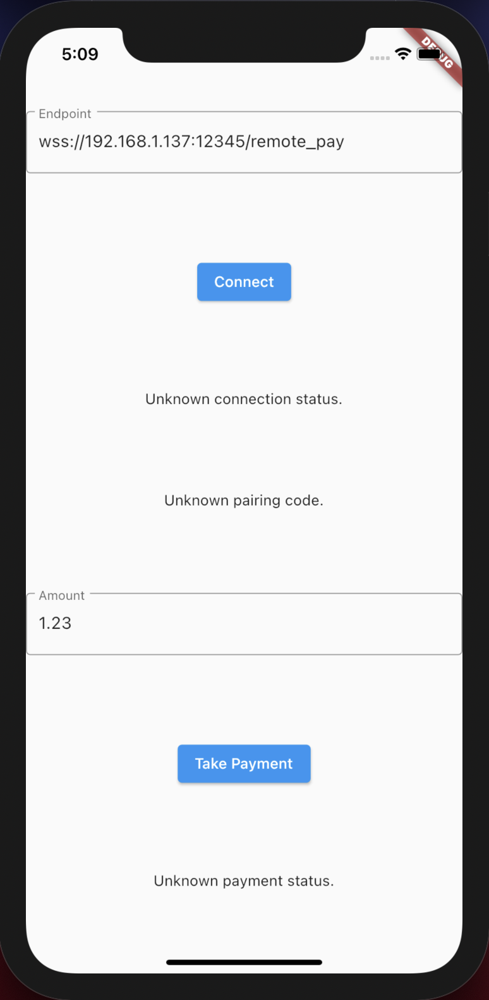

# Clover Semi-integration for Flutter-based POS (iOS)

## Screenshot

## Supported devices

### Flutter-based POS
- iPhone
- iPad

### Clover
- [Clover Mini](https://www.clover.com/pos-systems/mini-plp)
- [Clover Flex](https://www.clover.com/pos-systems/flex-plp)

## Technical

This project is a Clover Semi-integration for a Flutter-based POS application which run on iOS.

A few resources to get you started:

- [Flutter: Writing custom platform-specific code](https://flutter.dev/docs/development/platform-integration/platform-channels?tab=ios-channel-swift-tab)
- [Clover: Clover Connector iOS SDK](https://docs.clover.com/docs/ios)
- [Clover: Configuring Secure Network Pay Display](https://docs.clover.com/docs/configuring-secure-network-pay-display)
- [App icon Generator](https://appicon.co)
